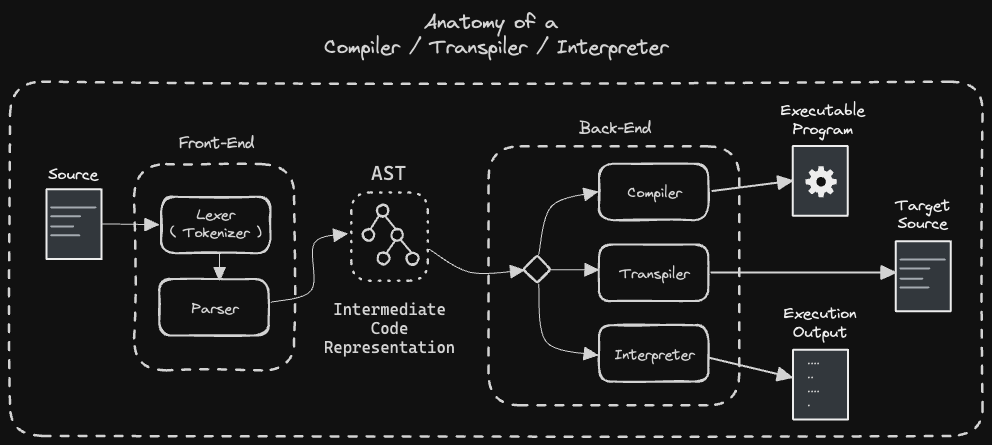

# ds-ast

DS ( Data Structure ) AST (Abstract Syntax Tree)

## Implementations

- [TypeScript implementation of: _**Building a Parser from scratch**_](./implementations/ts-parser-from-scratch/README.md)

## Definitions



### Lexer

> A **lexer** transforms a sequence of characters into a sequence of tokens.
>
> A compiler **lexer** is a crucial component in the compilation process of a programming language. It is responsible for breaking down the source code into smaller, meaningful units called tokens or lexemes. These tokens are then fed into the parser, which constructs the abstract syntax tree (AST) of the program.

```ts
enum TokenType {
  ...
}

interface TokenPosition {
  /** line */
  ln: number;
  /** column */
  col: number;
}

interface Token {
  type: TokenType;
  lexeme: string;

  /** it's useful for debugging proprose later one for a given programming language */
  position?: TokenPosition;
}

type LexerFn = (input: string) => Token[];
```

#### Key Features of a Compiler Lexer

- **Tokenization:** The lexer converts the source code into tokens, which are the smallest syntactic units of the language. These tokens can be identifiers, keywords, literals, operators, or other special characters.

- **Regular Expressions:** The lexer uses regular expressions to define the patterns for identifying these tokens. This approach allows for efficient and flexible token recognition.

- **State Transition Table:** The lexer can be implemented using a state transition table, which is a table-driven approach that directly jumps to follow-up states via goto statements. This approach can produce faster lexers than hand-coded ones.

### Parser

> A **parser** is a software component that takes input data (typically text) and builds a data structure, often a parse tree or abstract syntax tree (AST), giving a structural representation of the input while checking for correct syntax. It is a crucial part of the compilation process, particularly in compiler design.

#### RDP - Recursive Descent Parser

- [Recursive Descent Parser | GeeksforGeeks](https://www.geeksforgeeks.org/recursive-descent-parser/) (2023/06/09)

### AST

> An **Abstract Syntax Tree** (_AST_) is a data structure used in computer science to represent the structure of a program or code snippet. It is a tree-like representation of the source code, abstracting away the syntax and semantics of the programming language. The AST is designed to preserve essential information such as variable types, the location of each declaration, the order of executable statements, left and right components of binary operations, and identifiers and their assigned values.

## Tools

- [AST explorer](https://astexplorer.net/)

## References

### Theory

- [[YouTube Playlist] Compiler Design - Quick Concepts | Neso Academy](https://www.youtube.com/playlist?list=PLBlnK6fEyqRgfOB2fidzM9n11SQIA76_e)

- [[YouTube Playlist] Compiler Design - Chapter 1 - Introduction to Compiler Design | Neso Academy](https://www.youtube.com/playlist?list=PLBlnK6fEyqRgo_ukpWHcHzHptrnCSGteB)

- [[YouTube Playlist] Compiler Design - Chapter 2 - Syntax Analysis | Neso Academy](https://www.youtube.com/playlist?list=PLBlnK6fEyqRhMjOLYfqGdyB7Gt_k5cD6t)

- [[YouTube Playlist] Compiler Design - Chapter 3 - Top-Down Parsers | Neso Academy](https://www.youtube.com/playlist?list=PLBlnK6fEyqRgPLTKYaRhcMt8pVKl4crr6)

- [A Guide To Parsing: Algorithms And Terminology | Gabriele Tomassetti](https://tomassetti.me/guide-parsing-algorithms-terminology/) (2023/07/26)

- [Compilers Series' Articles | by Paul Lefebvre - DEV Community](https://dev.to/lefebvre/series/21363)

  - [Compilers 101 - Overview and Lexer](https://dev.to/lefebvre/compilers-101---overview-and-lexer-3i0m) (2018/01/19)

  - [Compilers 102 - Parser](https://dev.to/lefebvre/compilers-102---parser-2gni) (2018/01/22)

#### Compiler

- [Computer Language - (Compiler|Interpreter) - Language translator | DataCadamia](https://datacadamia.com/code/compiler/compiler)

#### Lexer

- [What is a Lexer ? known also as Tokenizer or Scanner - Lexical Analysis | DataCadamia](https://datacadamia.com/code/compiler/lexer)

- [Lexical Analysis - (Token|Lexical unit|Lexeme|Symbol|Word) | DataCadamia](https://datacadamia.com/code/compiler/token)

#### Parser

- [Lexical Analysis - Parser (Syntax analysis|Linter) | DataCadamia](https://datacadamia.com/code/compiler/parser)

#### AST

- [Parser / Compiler - (Abstract) Syntax Tree (AST) | DataCadamia](https://datacadamia.com/code/compiler/ast)

- [Abstract Syntax Tree (AST) - Explained in Plain English | DEV Community](https://dev.to/balapriya/abstract-syntax-tree-ast-explained-in-plain-english-1h38) (2024/06/11) - As a developer, the source code that you write is all so concise and elegant.

- [Tree traversal | Wikipedia](https://en.wikipedia.org/wiki/Tree_traversal)

- [[GitHub] cowchimp/awesome-ast](https://github.com/cowchimp/awesome-ast) - A curated list of awesome AST resources

### Implementation

- [[YouTube] LLVM in 100 Seconds | Fireship](https://www.youtube.com/watch?v=BT2Cv-Tjq7Q) (2022/05/23)

- [Writing Your Own Lexer With Simple Steps | Serhii Chornenkyi](https://serhii.io/posts/writing-your-own-lexer-with-simple-steps) (2023/11/24)

- [[YouTube Playlist] Creating a Compiler | Pixeled](https://www.youtube.com/playlist?list=PLUDlas_Zy_qC7c5tCgTMYq2idyyT241qs)

  - [[GitHub] hydrogen-cpp](https://github.com/orosmatthew/hydrogen-cpp)

- [A simple recursive descent parser | DEV Community](https://dev.to/6502/a-recursive-descent-parser-8jp) (2023/10/09)

- [[YouTube Playlist] Build a Custom Scripting Language In Typescript - Introduction to Interpreters & Compilers | tylerlaceby](https://www.youtube.com/playlist?list=PL_2VhOvlMk4UHGqYCLWc6GO8FaPl8fQTh)

  - [[GitHub] tlaceby/guide-to-interpreters-series](https://github.com/tlaceby/guide-to-interpreters-series) - Contains source-code for viewers following along with my Beginners Guide To Building Interpreters series on my Youtube Channel.

- [Let's Build A Simple Interpreter | Ruslan's Blog](https://ruslanspivak.com/lsbasi-part1/)

  - [Part 7: Abstract Syntax Trees | Ruslan's Blog](https://ruslanspivak.com/lsbasi-part7/) (2015/12/15) - [python](https://github.com/rspivak/lsbasi/blob/master/part7/python/spi.py) and [rust](https://github.com/rspivak/lsbasi/blob/master/part7/rust/spi/src/main.rs) implementations

  - [Part 13: Semantic Analysis | Ruslan's Blog](https://ruslanspivak.com/lsbasi-part13/) (2017/04/27)

- [[YouTube Playlist] Building a Compiler in JS | benwatkins10xd](https://www.youtube.com/playlist?list=PLKddWTBxzVCLRCltbWZxCyKm3IqkjEsBw)

  - [[GitHub] benwatkins10xd/js-compile](https://github.com/benwatkins10xd/js-compile) - Compiler in vanilla javascript from scratch

- [[YouTube] abstract syntax tree's are gonna be IMPORTANT in 2024 | Chris Hay](https://www.youtube.com/watch?v=vgRQREmr0rA) (2023/12/28)

  - [[GitHub] chrishayuk/typescript-parsing](https://github.com/chrishayuk/typescript-parsing)
