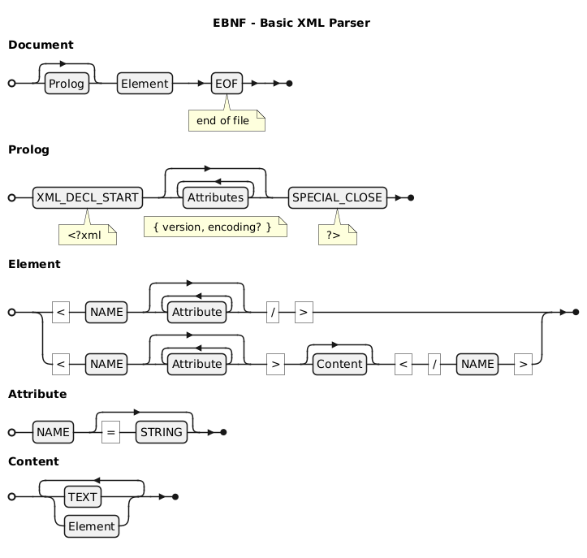

[⬅️ README](../../README.md)

# ts-parser-xml

> [!NOTE]
>
> **Simple** XML parser implementation, the idea here is not to implemente a full support into the XML language.
>
> The goal here is to acquire the knowledge that might help me to whenever I need to process a givem XML string.

> [!WARNING]
>
> there are no support for tags with namespaces, for example: `ns:tag-name`

## Commands

### Setup

- Project template: [[GitHub] erkobridee/vitest-ts](https://github.com/erkobridee/vitest-ts)

```
npm i
```

### Single execution

> to check the output at the terminal

#### Lexer

```
npm run lexer
```

#### Parser

```
npm run parser
```

### Development

The following command will start the vitest

```
npm start

or

npm run dev
```

## Documentation

### Lexer

> [!TIP]
>
> On this implementation I have added the support to line and column position of the readed token

- [Token.ts](src/lexer/Token.ts) - tokens specifications

  - [Token.spec.ts](src/lexer/__tests__/Token.spec.ts)

- [Lexer.ts](src/lexer/Lexer.ts) - engine that produces the tokens

  - [Lexer.spec.ts](src/lexer/__tests__/Lexer.spec.ts)

- <details>
    <summary>See the EBNF Diagram - Lexer</summary>
    <br>

  

  </details>

### Parser

- [Parser.ts](src/parser/Parser.ts)

#### States Machine

- [StatesMachine.ts](src/parser/states-machine/StatesMachine.ts)

##### Basic XML

- [StatesMachineXML.ts](src/parser/states-machine/StatesMachineXML.ts)

  - [ParserXML.spec.ts](src/parser/__tests__/ParserXML.spec.ts)

- <details>
  <summary>See the EBNF Diagram - Basic XML States Machine</summary>
  <br>

  

  </details>

##### Basic HTML

- [StatesMachineHTML.ts](src/parser/states-machine/StatesMachineHTML.ts) 🏗️ - TODO: implement 🚧

  - [ParserHTML.spec.ts](src/parser/__tests__/ParserHTML.spec.ts) 🏗️ - TODO: implement 🚧

- <details>
  <summary>See the EBNF Diagram - Basic HTML States Machine</summary>
  <br>

  

  </details>

#### AST

- [AST.ts](src/parser/AST.ts) 🚧 - It needs to be reviewed

- <details>
  <summary>See the Mermaid.js Class Diagram</summary>
  <br>

  ```mermaid
  classDiagram

  note for INodeDocument "TAbstractSyntaxTree"

  note for INodeSpecialElement "for example the script and/or style tags"

  INodeDocument "1" --> "1" INodeElement
  INodeElementBase "1" --> "0..n" IElementAttribute

  INodeDocument --|> INodeBase : extends
  INodeValue --|> INodeBase : extends
  INodeElementBase --> INodeBase : extends

  INodeText --|> INodeValue : extends
  INodeCData --|> INodeValue : extends
  INodeRawText --|> INodeValue : extends

  INodeSpecialElement --|> INodeElementBase : extends
  INodeElement --|> INodeElementBase : extends

  INodeBase "1" --> "1" NodeType

  TElementChildren --* INodeText
  TElementChildren --* INodeCData
  TElementChildren --* INodeSpecialElement
  TElementChildren <--* INodeElement

  class NodeType {
      << enum >>
      Document
      Element
      SpecialElement
      Text
      CData
      RawText
  }


  class INodeBase {
      type: NodeType
  }

  class INodeValue {
      value: string
  }


  class INodeText {
      type: NodeType.Text
  }

  class INodeCData {
      type: NodeType.CDATA
  }


  class INodeRawText {
      type: NodeType.RawText
  }


  class IElementAttribute {
      name: string
      value?: string
  }

  class INodeElementBase {
      name: string
      attributes?: IElementAttribute[]
  }

  class INodeSpecialElement {
      type: NodeType.SpecialElement
      content: INodeRawText
  }

  class TElementChildren {
      << type >>
  }

  class INodeElement {
      type: NodeType.Element
      children: TElementChildren[]
  }

  class INodeDocument {
      type: NodeType.Document
      root: INodeElement
  }

  ```

  </details>

## References

#### XML

- [XML | Wikipedia](https://en.wikipedia.org/wiki/XML)

- [Extensible Markup Language (XML) | W3C](https://www.w3.org/XML/)

  - [Extensible Markup Language (XML) 1.1 (Second Edition) | W3C](https://www.w3.org/TR/2006/REC-xml11-20060816/)

- [XML introduction - XML: Extensible Markup Language | MDN](https://developer.mozilla.org/en-US/docs/Web/XML/XML_introduction)

- [Parsing and serializing XML - XML: Extensible Markup Language | MDN](https://developer.mozilla.org/en-US/docs/Web/XML/Parsing_and_serializing_XML)

- [A Really, Really, Really Good Introduction to XML | SitePoint](https://www.sitepoint.com/really-good-introduction-xml/)

#### HTML

- [WHATWG](https://whatwg.org/)

  - [Standards](https://spec.whatwg.org/)

    - [HTML Standard](https://html.spec.whatwg.org/)

      - [HTML Syntax](https://html.spec.whatwg.org/multipage/syntax.html)

- [Void element | MDN](https://developer.mozilla.org/en-US/docs/Glossary/Void_element)

- [Empty HTML Tags (21 Weird Things You Need To Know!) | Matthew James Taylor](https://matthewjamestaylor.com/empty-tags)

- [Self Closing Tags | Code Kracken](https://www.codekracken.com/self-closing-tags/)

- [HTML Easy](https://www.html-easy.com/) - Learn HTML the Easy Way

  - [References | HTML Easy](https://www.html-easy.com/references/)

    - [HTML style Tag: Usage, Attributes, and Examples | HTML Easy](https://www.html-easy.com/references/html-style-tag/)

#### SSML

> Text-to-Speech

- [SSML - Speech Synthesis Markup Language : Specification | W3C](https://www.w3.org/TR/speech-synthesis/)

- [Speech Synthesis Markup Language | Wikipedia](https://en.wikipedia.org/wiki/Speech_Synthesis_Markup_Language)

- [Speech Synthesis Markup Language: An Introduction | XML.com](https://www.xml.com/pub/a/2004/10/20/ssml.html)

- [Speech Synthesis Markup Language (SSML) | Cloud Text-to-Speech API - Google Cloud](https://cloud.google.com/text-to-speech/docs/ssml?hl=en)

- [Speech Synthesis Markup Language (SSML) overview - Speech service - Azure AI services | Microsoft Learn](https://learn.microsoft.com/en-us/azure/ai-services/speech-service/speech-synthesis-markup)

- [Introduction to SSML | WebSphere Voice Server / 6.1.1 - IBM Documentation](https://www.ibm.com/docs/en/wvs/6.1.1?topic=guide-introduction-ssml)

- [Text to Speech XML: A Comprehensive Guide to SSML and Its Applications | Speechify](https://speechify.com/blog/text-to-speech-xml-a-comprehensive-guide-to-ssml-and-its-applications/)

### ANTLR v4 Grammar

- [[GitHub] antlr/grammars-v4](https://github.com/antlr/grammars-v4) - Grammars written for ANTLR v4; expectation that the grammars are free of actions.

  - [xml](https://github.com/antlr/grammars-v4/tree/master/xml) - [lexer](https://github.com/antlr/grammars-v4/blob/master/xml/XMLLexer.g4) | [parser](https://github.com/antlr/grammars-v4/blob/master/xml/XMLParser.g4)

### EBNF

- [EBNF for XML 1.0 | Jelks' Home Page](https://www.jelks.nu/XML/xmlebnf.html)

- [XML 1.0 EBNF | Liquid Technologies - XML Glossary](https://www.liquid-technologies.com/Reference/Glossary/XML_EBNF1.0.html)

- [XML 1.1 EBNF | Liquid Technologies - XML Glossary](https://www.liquid-technologies.com/Reference/Glossary/XML_EBNF1.1.html)

### Implementations

- [[GitHub] pladaria/xml-lexer](https://github.com/pladaria/xml-lexer) - Javascript XML Lexer

- [[GitHub] holloway/xml-zero.js](https://github.com/holloway/xml-zero.js) - Friendly and forgiving HTML5/XML5 parser that supports React JSX, and uses zero-copy techniques

  - [packages/xml-zero-lexer](https://github.com/holloway/xml-zero.js/tree/master/packages/xml-zero-lexer) -Friendly and forgiving HTML5/XML5/React-JSX lexer/parser with lots of tests. Memory-efficient and Web Worker compatible.

- [[GitHub] FullStackPlayer/ts-xml-parser](https://github.com/FullStackPlayer/ts-xml-parser) - A better xml parser written in pure typescript and works well with deno.

- [[GitHub] NaturalIntelligence/fast-xml-parser](https://github.com/NaturalIntelligence/fast-xml-parser) - Validate XML, Parse XML and Build XML rapidly without C/C++ based libraries and no callback.

- [[GitHub] kornelski/xml-rs](https://github.com/kornelski/xml-rs) - An XML library in Rust ( [lexer](https://github.com/kornelski/xml-rs/blob/main/src/reader/lexer.rs) )

### Utils

- [Optimizing Javascript for fun and for profit | romgrk](https://romgrk.com/posts/optimizing-javascript) ( 2024-03-21 )

- [Unicode Explorer](https://unicode-explorer.com/)

  - [Unicode blocks | Unicode Explorer](https://unicode-explorer.com/blocks)

- [UnicodePlus](https://unicodeplus.com/)

  - [Unicode Blocks | UnicodePlus](https://unicodeplus.com/block)

#### RegExp

- [Regex Vis](https://regex-vis.com/)

- [Regular Expressions 101](https://regex101.com/)

- [Regular expressions | javascript.info](https://javascript.info/regular-expressions)

- [Regular Expressions > JavaScript | MDN](https://developer.mozilla.org/en-US/docs/Web/JavaScript/Guide/Regular_expressions)

  - [Character classes > Regular Expressions > JavaScript | MDN](https://developer.mozilla.org/en-US/docs/Web/JavaScript/Guide/Regular_expressions/Character_classes)

##### Unicode

- [Regexp - Unicode: flag "u" and class \p{...} | javascript.info](https://javascript.info/regexp-unicode)

- [Unicode | Understanding JavaScript RegExp](https://learnbyexample.github.io/learn_js_regexp/unicode.html)

#### Class Diagrams

- [Mermaid Class Diagram | Mermaid Docs](https://mermaid.js.org/syntax/classDiagram.html)

- [UML Class Diagram Relationships Explained with Examples | Creately](https://creately.com/guides/class-diagram-relationships/)
